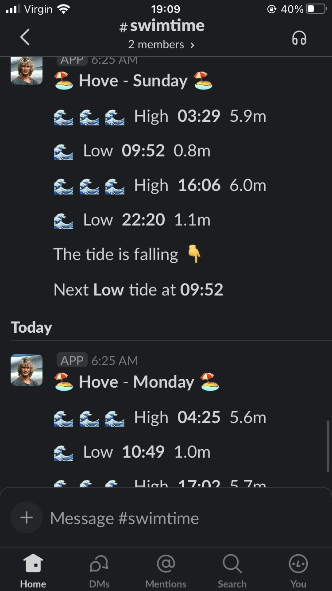

# Point Break

## Overview

This is a notification service that provides a daily update of tide times for Hove (Shoreham,
actually).

It uses the following services and APIs:

* [UK Hydrographic Office Tidal Events API](https://admiraltyapi.portal.azure-api.net/docs/services/uk-tidal-api-foundation)
  and the [Slack webhooks API]
    * Provides the core information around the times for high and low tides
* [Slack webhooks](https://api.slack.com/messaging/webhooks)
    * Provides the information channel via webhook messages from a bot installed as an App in the
      workspace
* [AWS Lambda](https://aws.amazon.com/lambda/)
    * Along with [Event Bridge](https://aws.amazon.com/eventbridge/) as the scheduler, this provides
      the execution environment

## Pre-requisites

* Sign up for the UKHO APIs (see above) or use an alternative source
    * If you use an alternative source then you will need to implement your
      own ````tech.dsoc.labs.bodhi.tides.TidesApiResponseHandler````
* [Create an app on Slack](https://api.slack.com/authentication/basics#creating) and install it to
  your channel
    * This will give you a Slack webhook URL which you will need to set (see below)

## Getting it running

* Create a Lambda function that uses
  the ````tech.dsoc.labs.bodhi.tides.BodhiAwsHandler::handleEvent```` as its target
    * This example assumes the function name is ````point-break````
    * The Lambda runtime should be ````Java 11````
    * Create an EventBridge event to trigger the Lambda using a Cron expression for the time you
      want the job to run
    * An example cron expression for EventBridge is ````cron(25, 6, * * ? *)```` which runs at 06:25
      UTC every day
* Add the required configuration to the Lambda function
    * Click on the function name
    * On the LH navbar select the ````Configuration```` menu item
    * Add some ````Environment Variables````. You will need:
        * ````OCP_HEADER = Ocp-Apim-Subscription-Key````
        * ````API_KEY = <The API token for your subscription to the UKHO Tidal Foundation API>````
        * ````WEBHOOK_URI = <The URI you got when you installed the Slack bot app to your channel>````
* Package the service using ````mvn package````
* Using the [AWS CLI](https://aws.amazon.com/cli/) and your AWS credentials, deploy the application
    * Navigate to the ````target```` directory and locate the ````jar```` file,
      e.g. ````./target/point-break-1.0.0.jar````
    * Deploy the runtime
      by ````aws lambda update-function-code --function-name point-break --zip-file fileb://point-break-1.0.0.jar````
        * If you have named your function something other than ````point-break```` then just chane
          the name in the command above
* The function will run as per the schedule you created
    * You can test it immediately from the ````Test```` button on the AWS Lambda Console (
      see ````Test```` tab)

### Running locally

If you have Java 11 installed and/or an IDE, you can run the application locally by
invoking ````tech.dsoc.labs.bodhi.tides.Bodhi::main````

## Example output

